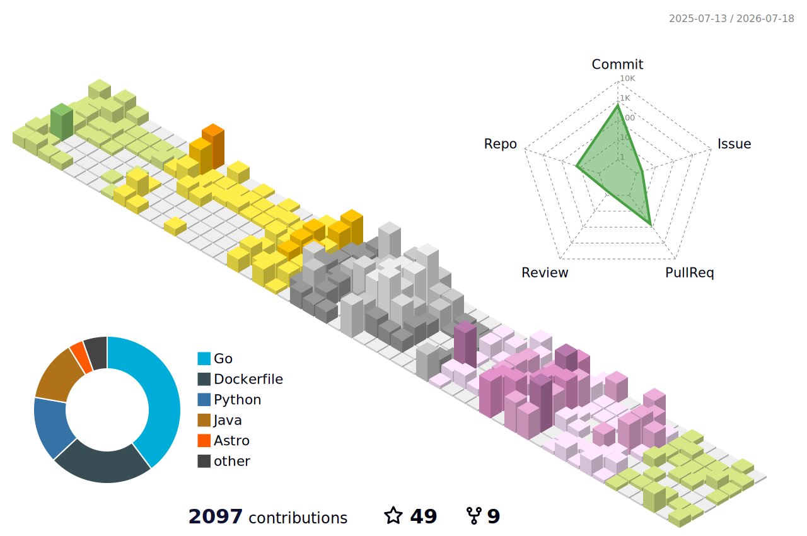

<h2 align="center">Hi 👋, I'm Yang</h2>

  

<!-- 

  

 -->

 

<h2 align="center">Languages and Tools</h2>

 
  
  &nbsp;&nbsp;
   
  &nbsp;&nbsp;
   
  &nbsp;&nbsp;
   
  &nbsp;&nbsp;
   
  &nbsp;&nbsp;
   
  &nbsp;&nbsp;
   
  &nbsp;&nbsp;
   
  &nbsp;&nbsp;
   
  &nbsp;&nbsp;
   
  &nbsp;&nbsp;
   
  &nbsp;&nbsp;
   
  &nbsp;&nbsp;
   

 

 

<h3 align="left">Connect with me:</h3>

- 📫 **bmVrb2ltaW1lQGdtYWlsLmNvbQ==**

 

  

