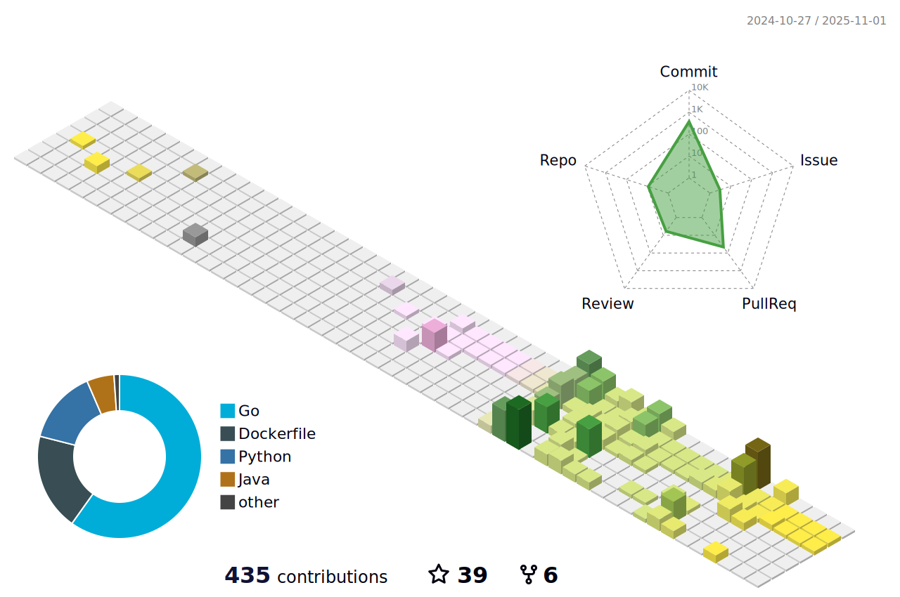

<!-- ## Hi there 👋 -->

<!--
**nekoimi/nekoimi** is a ✨ _special_ ✨ repository because its `README.md` (this file) appears on your GitHub profile.

Here are some ideas to get you started:

- 🔭 I’m currently working on ...
- 🌱 I’m currently learning ...
- 👯 I’m looking to collaborate on ...
- 🤔 I’m looking for help with ...
- 💬 Ask me about ...
- 📫 How to reach me: ...
- 😄 Pronouns: ...
- ⚡ Fun fact: ...
-->

<!--

  
  

  
  

-->

<h2 align="center">Hi 👋, I'm nekoimi</h2>

  

<!-- 

  

 -->

<!--

-->

 

<h2 align="center">Languages and Tools</h2>

 
  
  &nbsp;&nbsp;
   
  &nbsp;&nbsp;
   
  &nbsp;&nbsp;
   
  &nbsp;&nbsp;
   
  &nbsp;&nbsp;
   
  &nbsp;&nbsp;
   
  &nbsp;&nbsp;
   
  &nbsp;&nbsp;
   
  &nbsp;&nbsp;
   
  &nbsp;&nbsp;
   
  &nbsp;&nbsp;
   

<!--

&nbsp;

-->

<!--

  
  

-->

 

 

- 📫 How to reach me **nekoimime@gmail.com**

<!--
<h3 align="left">Connect with me:</h3>

-->

 

  

